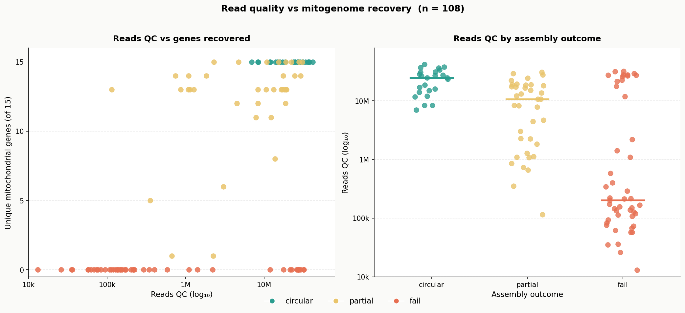
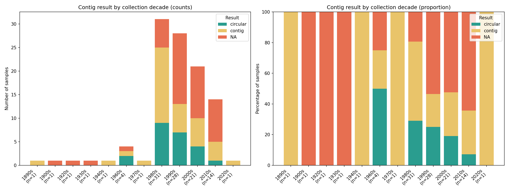

# Mitogenome Assembly Quality Analysis – AVITI Run 24032

[](https://creativecommons.org/licenses/by/4.0/)

Analysis of mitochondrial genome assembly outcomes for 108 natural history specimens sequenced on the Naturalis AVITI platform (run **20260428_AV250703_24032-5021000_28_04_2026**). The workflow links [Skim2Mito](https://github.com/o-william-white/skim2mito) assembly metrics to specimen metadata from the Naturalis Biodiversity Center collections, and explores whether collection year, collector identity, taxonomy, or sequencing depth predict assembly success.

---

## Results at a glance

### 1 · Read quality vs mitogenome recovery



*Left: log₁₀(reads QC) vs unique mitochondrial genes recovered, coloured by outcome. Right: reads QC distribution per outcome category with median bar. Samples below ~1M QC reads almost always fail; above that threshold DNA quality (proxied by collection age) becomes the limiting factor.*

To see individual sample names, open the interactive version and hover over the chart: [output/reads_vs_assembly.html](https://htmlpreview.github.io/?https://github.com/dickgroenenberg/aviti_genome_skim_24032/blob/main/output/reads_vs_assembly.html)

### 2 · Assembly outcome by collection decade



*Stacked bar chart of circular / partial / fail counts per collection decade (n = 105 samples with known year). Older specimens skew towards fail, consistent with DNA degradation in dried museum material. Collector identity (χ² p = 0.28) and genus (χ² p = 0.65) showed no significant association with outcome.*

To see which samples make up each bar segment, open the interactive version and hover over the chart: [output/contig_result_by_decade.html](https://htmlpreview.github.io/?https://github.com/dickgroenenberg/aviti_genome_skim_24032/blob/main/output/contig_result_by_decade.html)

---

## Background

Mitochondrial genomes are assembled from AVITI short reads using **[Skim2Mito](https://github.com/o-william-white/skim2mito)** (White, O.W.), a pipeline designed for low-coverage mitogenome assembly from museum and fresh specimens. The input files used in this repository come from the **`summary/` output folder** of Skim2Mito:

| Skim2Mito output file | Role here |
|---|---|
| `summary/summary_samples_mqc.txt` | Per-sample read QC statistics |
| `summary/summary_contigs_mqc.txt` | Per-contig assembly metrics and gene annotations |
| `summary/summary_gene_counts_mqc.txt` | Per-sample presence/absence matrix for 15 canonical mitochondrial genes |

Assembly outcomes are classified as:

| Category | Meaning |
|---|---|
| **circular** | Complete circular mitogenome assembled (ideal) |
| **partial** | One or more linear contigs; mitogenome partially recovered |
| **fail** | No contig assembled |

---

## Raw data

Raw sequencing reads are stored internally at Naturalis Biodiversity Center under AVITI run:

```
20260428_AV250703_24032-5021000_28_04_2026
```

Contact the Naturalis genomics facility for access. The three Skim2Mito summary files and the specimen metadata in `data/` are derived from that run and are included here for full reproducibility.

---

## Repository structure

```
.
├── data/
│   ├── summary_contigs_mqc.txt        # Skim2Mito: per-contig assembly output
│   ├── summary_samples_mqc.txt        # Skim2Mito: per-sample read QC stats
│   ├── summary_gene_counts_mqc.txt    # Skim2Mito: gene presence/absence matrix
│   └── 24032_metadata.xlsx            # Specimen metadata (Naturalis collections)
│
├── scripts/
│   ├── 01_merge_ids.py                # ID harmonisation + merged result table
│   ├── 02_plot_decade_barchart.py     # Interactive stacked bar chart by decade
│   └── 03_plot_reads_vs_assembly.py   # Scatter + strip chart (reads vs recovery)
│
├── output/
│   ├── contig_year_summary.xlsx       # Merged table: ID, assembly result, year
│   ├── contig_result_by_decade.html   # Interactive bar chart (standalone)
│   ├── contig_result_by_decade.png    # Static bar chart
│   ├── reads_vs_assembly.html         # Interactive scatter + strip chart (standalone)
│   └── reads_vs_assembly.png          # Static scatter + strip chart
│
├── requirements.txt
├── LICENSE
└── README.md
```

---

## Data files

### `data/summary_contigs_mqc.txt`
Tab-separated. One row per assembled contig. Key columns:

| Column | Description |
|---|---|
| `ID` | Full sequencing ID (run + well + specimen, underscore-separated) |
| `Contig` | Contig name; contains `circular` for complete mitogenomes, `NA` for no assembly |
| `N. genes` | Annotated mitochondrial genes on this contig |
| `Genes list` | Comma-separated gene names; split genes suffixed `_0`, `_1`, … by Skim2Mito |

### `data/summary_samples_mqc.txt`
Tab-separated. One row per sample.

| Column | Description |
|---|---|
| `ID` | Full sequencing ID |
| `Reads raw` | Total raw read pairs |
| `Reads QC` | Read pairs passing quality control |

### `data/summary_gene_counts_mqc.txt`
Tab-separated heatmap matrix. One row per sample that produced at least one contig. Columns are the 15 canonical mitochondrial genes (13 PCGs + rrnL + rrnS). Values are counts (0 = absent, 1 = present, 2 = present on two separate contigs).

### `data/24032_metadata.xlsx`
Specimen metadata from the Naturalis collection management system.

| Column | Description |
|---|---|
| `Sample ID` | Specimen identifier (dot- or colon-separated, e.g. `RMNH.INS.1719806`) |
| `Family` / `Genus` / `Species` | Taxonomic classification |
| `Collectors` | Collector name(s) |
| `Collection Date` | Date of collection |
| `Country/Ocean` | Country of collection |

### ID normalisation
The assembly summary prefixes each specimen ID with a run code and well position and uses underscores throughout. `scripts/01_merge_ids.py` matches IDs by converting the metadata ID to underscores and checking whether it is a suffix of the assembly ID (handling both dot- and colon-separated metadata IDs).

---

## Dependencies

Python ≥ 3.9. Install with:

```bash
pip install -r requirements.txt
```

`requirements.txt`: `openpyxl>=3.1`

Interactive HTML outputs use [Chart.js 4.4](https://www.chartjs.org/) from cdnjs (internet connection required to view).

---

## Usage

Run scripts in order from the repository root:

```bash
python scripts/01_merge_ids.py           # produce output/contig_year_summary.xlsx
python scripts/02_plot_decade_barchart.py # produce output/contig_result_by_decade.html
python scripts/03_plot_reads_vs_assembly.py # produce output/reads_vs_assembly.html
```

---

## Key findings

| Outcome | n | % |
|---|---|---|
| circular | 24 | 22% |
| partial | 37 | 34% |
| fail | 47 | 44% |

- **Collection year** is the strongest predictor of assembly success. Specimens collected after ~1980 yield proportionally more complete assemblies.
- **Sequencing depth**: samples below ~1M QC reads almost always fail; above that threshold DNA quality is the bottleneck.
- **Collector** (χ² p = 0.28) and **genus** (χ² p = 0.65): no significant association with assembly outcome.

---

## FAIR principles

| Principle | Implementation |
|---|---|
| **Findable** | Versioned repository with descriptive README; recommend depositing to [Zenodo](https://zenodo.org) or [4TU.ResearchData](https://data.4tu.nl) for a persistent DOI |
| **Accessible** | Input data included in `data/`; raw reads archived at Naturalis under run ID above |
| **Interoperable** | Open formats throughout: TSV, XLSX, HTML, PNG; Skim2Mito standard output formats |
| **Reusable** | CC BY 4.0 license; documented scripts with docstrings; `requirements.txt`; methodology described in README |

---

## Citation

If you use this analysis, please cite:

> *Naturalis Biodiversity Center mitogenome assembly analysis, AVITI run 20260428_AV250703_24032-5021000_28_04_2026.* Available at: https://github.com/naturalis/aviti_genome_skim_24032

And cite Skim2Mito:

> White, O.W. *Skim2Mito*. https://github.com/o-william-white/skim2mito

---

## License

[Creative Commons Attribution 4.0 International (CC BY 4.0)](https://creativecommons.org/licenses/by/4.0/)
